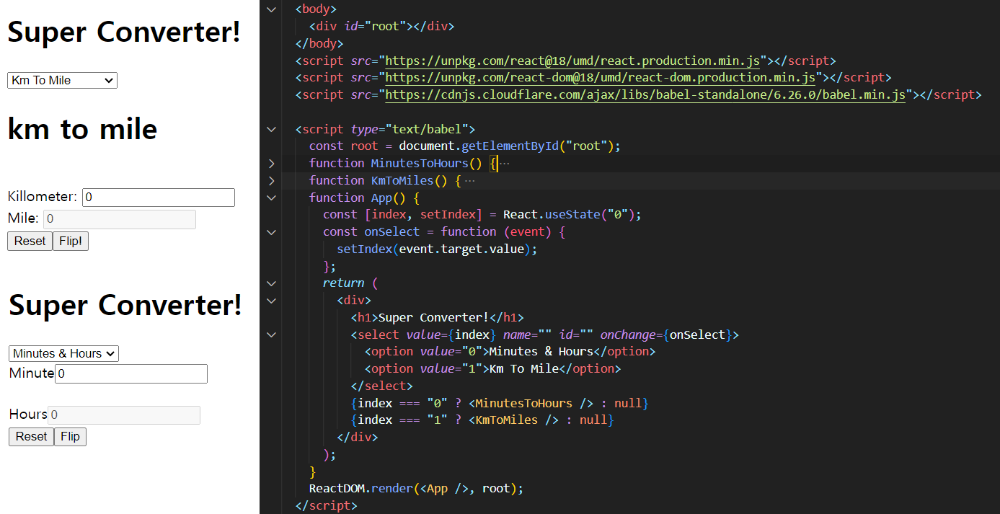

# React.js 연습하기

#### 1일차.

Vue.js 와 다른점이 확연하다. 거의 모든걸 Script 부분에서 JSX 문법을 이용해 사용한다.

Vue.js에서는 HTML에서 props 등을 추가해서 훨씬 더 직관적인 느낌이었는데.... 

아직까진 뭔가 불편해 보인다. 조금더 깊게 배우면 나아지겠지.

#### 2일차.

해보니까 방식은 Vue랑 비슷한것 같기도..?

JSX 문법 배웠다.

React.useState() 를 이용해 state값을 변경하는 방법을 배웠다.

컴포넌트를 렌더링하는 방식의 개발방법을 배우고 실습해봤다.

## 3 & 4일차.

module.css

useState

useEffect => 한번만 실행하고싶은 것들을 지정하는곳

useEffect(한번만실행할코드 or 함수, [변화를감지할 state(dependency 라고부름)])

음... Vue에 watch 랑 비슷한기능인가..??? 아니면 LifeCycleHooks 의 기능인가?? 아직 헷갈림

