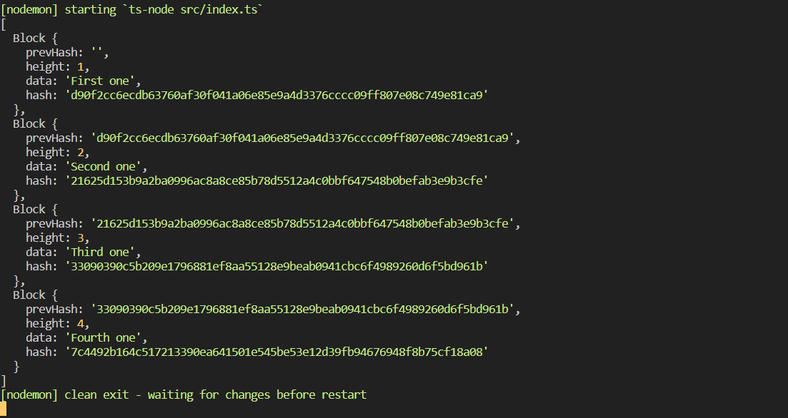

# TS로 BlockChain 만들기 실습

배운점:

- 블록체인의 기본 동작방식

- crypto 모듈을 이용한 Hash값 생성하기

- JavaScript대신 TypeScript를 이용해 객체지향적인 개발방법에 대한 이해

- TS의 type과 interface, implements, extends 등등 상속에 대한 이해

- Generics 과 any type의 차이점에 대한 이해 

- 기타 등 등 
