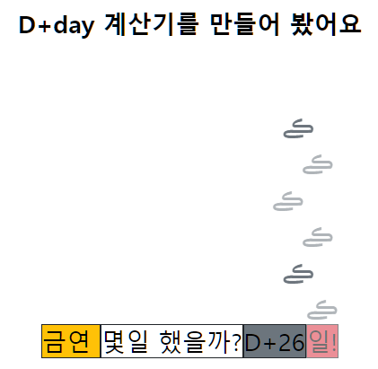

# D+day 계산기 만들기(개인활동)

### 만들게 된 계기:

Tistory 블로그에 금연일을 게시하기 시작했다.

매일 글 수정을 눌러 날짜를 올리기가 귀찮아서 D+day 계산기를 만들어보기로함.

### 설계:

- HTML에 모양을 잡아주고

- javascript Date관련 함수를 이용해 입력날짜와 현재 날짜를 받아온다.

- 오늘날짜-당시 기념일날짜의 값을  p Tag의 innerText로 지정해준다. 

- 부트스트랩을 이용해 외관을 꾸밈.

- 또한 아스키아트를 이용해 연기를 표현했고, 자바스크립트의 animation 기능을 이용해 연소되는 모습을 표현해보았다.

#### 느낀점 :

글을 누를때마다 코드가 실행될 수 있도록 만들었기 때문에글을 수정하지 않아도 내가 금연에 실패하지 않는 한 글을 수정할 필요가 없을 것이다.

뻘 짓처럼 보일 수 있지만 나름 재밌게 공부했다.  
